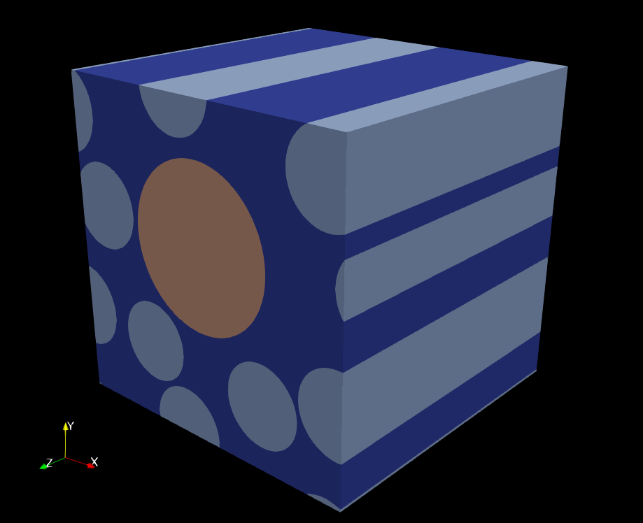

# RVEtool

## Description
<!--
Let people know what your project can do specifically. Provide context and add a link to any reference visitors might be unfamiliar with. A list of Features or a Background subsection can also be added here. If there are alternatives to your project, this is a good place to list differentiating factors.A
-->
RVEtool is a modeling package with different tools for meshing and run FEA of micromechanical models based on fiber-reinforced materials including the presence of defects. The different packages are devised to run in High-Performance Computing environments.

  * `RVE_gen`: It contains `.npz` files which are generated by specific algorithms for the generation of RVEs.
  * `RVE_mesher`: [Gmsh](https://gmsh.info) as submodule and main 2-d and 3-d finite element mesh generator with built-in pre processing capabilities.
  * `RVE_solver`: [Alya multiphysics](https://www.bsc.es/research-development/research-areas/engineering-simulations/alya-high-performance-computational) as the main FEA solver for High-Performance Computing.
  
`RVE_gen` main features:
- Only `.npz` files are supported.

`RVE_mesher` main features (Gmsh):
- 3-d mesh with linear hexahedron elements.
- Generation of the full Periodic Boundary Conditions (PBCs) based on master-slave nodes (Garoz et al. 2019).
- Coordinates correction at boundary nodes used for PBCs.
- Option to generate zero-thickness cohesive elements between fibers and the matrix.

`RVE_solver` main features (Alya multiphysics):
- Sequential (`ASCII`) format or parallel I/O (`MPIO`).
- Parallel mesh partitioning.
- Iterative solvers for symmetric and unsymmetric matrices.
- ...

## Pre-requisites

*Step 1:* Install Python3.0
- Download [Python](https://www.python.org).
- After its installation, open Terminal (macOS) or Command prompt (Windows) and go to the root of the folder and type the following command:

```
python -m pip install -r requirements.txt
```

*Step 2:* Install Gmsh
- Download [Gmsh](https://gmsh.info)  software. 
- Double-click the downloaded file and follow the installation wizard to finish the installation.
- Add this in your `PATH`:
```
export PATH=`gmsh_path:$PATH
```
*Step 3:* Update submodules
RVEtool uses a specific RVE generator not available as opensource. Source code can be shared with permission from the owner. Submodules are updated with the following command:

```
git submodule update --init --recursive
```

## Usage
Each folder contains a `main.py` file with the corresponding user inputs. Right now the user has to run the `main.py` for each `RVE_xxx` module.

## Output models
The RVE model generated here referred to as `jobName` is stored in the `output` folder. This folder is generated automatically if no exists. The user can define the number of load case scenarios for the RVE `jobName`. The current load cases are derived from transversally isotropic materials and they are the following:
- Longitudinal tension (11 component)
- Transverse tension (22 componenent)
- In-plane shear (12 component)
- Out-of-plane shear (23 compomnent)

The directory tree for the output folder is the following:
```bash
.
rvetool\
      outputs\
            jobName\ 
               ├──  msh\ is the folder containing the mesh files
   │     │     │     ├── jobName.dims.dat 
   │     │     │     ├── jobName.mat.dat
   │     │     │     ├── jobName.fie.dat
   │     │     │     ├── jobName.geo.dat
   │     │     │     ├── jobName.set.dat
   │     │     │     ├── jobName.fix.dat
   │     │     │     ├── jobName.per.dat
   │     │     │     └── ...             
   │     │     ├── jobName-11\ is the longitudinal tension case
   │     │     │     ├── jobName-11.dat
   │     │     │     ├── jobName-11.ker.dat
   │     │     │     ├── jobName-11.dom.dat
   │     │     │     ├── jobName-11.sld.dat
   │     │     │     └── jobName-11.post.alyadat 
   │     │     ├── jobName-22\ is the transverse tension case
   │     │     │     ├── jobName-22.dat
   │     │     │     ├── jobName-22.ker.dat
   │     │     │     ├── jobName-22.dom.dat
   │     │     │     ├── jobName-22.sld.dat
   │     │     │     └── jobName-22.post.alyadat 
   │     │     ├── jobName-12\ is the in-plane shear case
   │     │     │     ├── jobName-12.dat
   │     │     │     ├── jobName-12.ker.dat
   │     │     │     ├── jobName-12.dom.dat
   │     │     │     ├── jobName-12.sld.dat
   │     │     │     └── jobName-12.post.alyadat 
   │     │     └── jobName-23\ is the out-of-plane shear case
   │     │           ├── jobName-23.dat
   │     │           ├── jobName-23.ker.dat
   │     │           ├── jobName-23.dom.dat
   │     │           ├── jobName-23.sld.dat
   │     │           └── jobName-23.post.alyadat 
   │     └── ...
   └── README.md The main readme\
```

## License
Not defined yet.


## Support
:e-mail: Gerard Guillamet: <gerard.guillamet@bsc.es>\
:e-mail: Eloi Ruiz-Gironés: <eloi.ruizgirones@bsc.es>
