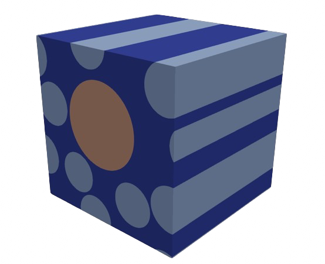

<div align="center">
  
  
</div>

# RVEtool for defects

## Description

RVEtoolDefects is a high-performance modeling package that integrates various tools for meshing and performing finite element analysis (FEA) on micromechanical models of fiber-reinforced materials, including the presence of defects (voids). Its primary finite element solver for high-fidelity structural mechanics simulations is [Alya multiphysics](https://www.bsc.es/research-development/research-areas/engineering-simulations/alya-high-performance-computational), designed for large-scale, high-performance computing. Additionally, COUPONtool is optimized for generating large-scale synthetic datasets, facilitating the deployment of advanced Artificial Intelligence (AI) models and enabling Uncertainty Quantification Analysis (UQA) when used with the [PyCOMPSs](https://pypi.org/project/pycompss/) parallel computing framework.


## Synthetic data generation

For synthetic data generation the RVEtoolDefects can be orchestrated by [PyCOMPSs](https://pypi.org/project/pycompss/) parallel framework. The use of PyCOMPSs allow to perform large-scale Design of Experiments (DoE) when is executed in HPC environments.

## RVEtoolDefects modules

RVEtoolDefects has three main modules for the finite element model generation:

  * `RVE_gen`: It requires `.npz` file containing the information of the morphology for the micromechanical unit-cell.
  * `RVE_mesher`: It uses [Gmsh](https://gmsh.info) as a 2-d and 3-d finite element mesh generator with built-in pre processing capabilities.
  * `RVE_solver`: It configures the necessary input files for running [Alya multiphysics](https://www.bsc.es/research-development/research-areas/engineering-simulations/alya-high-performance-computational).
  
`RVE_gen` main features:
- Only `.npz` files are supported.

`RVE_mesher` main features (Gmsh):
- 2-d and 3-d meshes with linear quadrilaterals/hexahedron elements.
- Generation of the full Periodic Boundary Conditions (PBCs) based on master-slave nodes (Garoz et al. 2019).
- Coordinates correction at boundary nodes used for PBCs.
- Option to generate zero-thickness cohesive elements between fibers and the matrix.

`RVE_solver` main features (Alya multiphysics):
- Sequential (`ASCII`) format or parallel I/O (`MPIO`).
- Parallel mesh partitioning.
- Iterative solvers for symmetric and unsymmetric matrices.

## Boundary Conditions

The RVEtool has the capability to apply different types of boundary conditions:

- Linear BCs: this method uses the prescription of the deformation gradient as `(F-I)`.
- Periodic BCs: this method uses displacement fluctuations and prescribes the deformation gradient as `(F-I)`.  
- Dirichlet with PBCs: this method is equivalent but requires a specific constraint of faces, edges and nodes to represent a loading case scenario.

## Pre-requisites

*Step 1:* Install Python3.0
- Download [Python](https://www.python.org).
- After its installation, open Terminal (macOS) or Command prompt (Windows) and go to the root of the folder and type the following command:

```
python -m pip install -r requirements.txt
```

*Step 2:* Install Gmsh
- Download [Gmsh](https://gmsh.info)  software. 
- Double-click the downloaded file and follow the installation wizard to finish the installation.
- Add this in your `PATH`:
```
export PATH=`gmsh_path:$PATH
```
*Step 3:* Update submodules
RVEtool uses a specific RVE generator not available as opensource. Source code can be shared with permission from the owner. Submodules are updated with the following command:

```
git submodule update --init --recursive
```

## General usage
The repository contains a main file named as `RVEtool.py` which loads a YAML file containing all the user inputs necessary for the generation, meshing and resolution of the micromechanical model. To command to run the RVEtool is:

```
python3 RVEtool.py --exp-file=/examples/job_name.yaml
```

## Output models

The RVE model generated here referred to as `jobName` is stored in the `output_path` folder. This folder is generated automatically if no exists. The user can define the number of load case scenarios for the RVE `jobName` following the material system (1-2-3) or the global system (x-y-z). The load cases available for 2D and 3D are the following:

2D models:
- Transverse tension (11 componenent)
- Transverse tension (22 componenent)
- In-plane shear (12 component)

3D models:
- Longitudinal tension (11 component)
- Transverse tension (22 componenent)
- In-plane shear (12 component)
- Out-of-plane shear (23 compomnent)

An example of the resulting directory (3D model, four load cases) for the output folder is the following:
```bash
.
rvetool\
      outputs\
            jobName\
               ├──  gen\ is the folder containing the CAD file and info of the RVE generated. 
               ├──  msh\ is the folder containing the mesh files
   │     │     │     ├── jobName.dims.dat 
   │     │     │     ├── jobName.mat.dat
   │     │     │     ├── jobName.fie.dat
   │     │     │     ├── jobName.geo.dat
   │     │     │     ├── jobName.set.dat
   │     │     │     ├── jobName.fix.dat
   │     │     │     ├── jobName.per.dat
   │     │     │     └── ...             
   │     │     ├── jobName-11\ is the longitudinal tension case
   │     │     │     ├── jobName-11.dat
   │     │     │     ├── jobName-11.ker.dat
   │     │     │     ├── jobName-11.dom.dat
   │     │     │     ├── jobName-11.sld.dat
   │     │     │     └── jobName-11.post.alyadat 
   │     │     ├── jobName-22\ is the transverse tension case
   │     │     │     ├── jobName-22.dat
   │     │     │     ├── jobName-22.ker.dat
   │     │     │     ├── jobName-22.dom.dat
   │     │     │     ├── jobName-22.sld.dat
   │     │     │     └── jobName-22.post.alyadat 
   │     │     ├── jobName-12\ is the in-plane shear case
   │     │     │     ├── jobName-12.dat
   │     │     │     ├── jobName-12.ker.dat
   │     │     │     ├── jobName-12.dom.dat
   │     │     │     ├── jobName-12.sld.dat
   │     │     │     └── jobName-12.post.alyadat 
   │     │     └── jobName-23\ is the out-of-plane shear case
   │     │           ├── jobName-23.dat
   │     │           ├── jobName-23.ker.dat
   │     │           ├── jobName-23.dom.dat
   │     │           ├── jobName-23.sld.dat
   │     │           └── jobName-23.post.alyadat 
   │     └── ...
   └── README.md The main readme\
```
